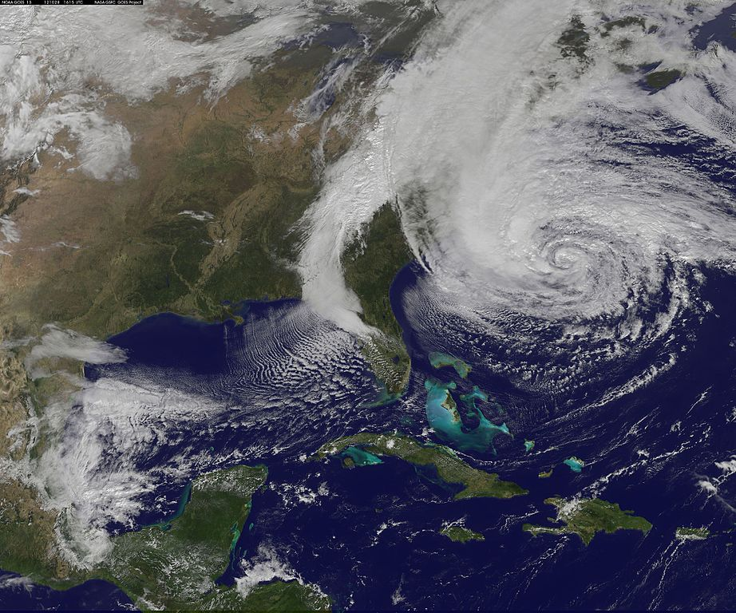

```{r setup, include=FALSE}
knitr::opts_chunk$set(echo = TRUE)
```

## Introduction

```{r fig.cap='NASA satellite image of hurricane Sandy, 2012 (source: wikimedia commons)', echo = FALSE, out.width='75%'}

```


> "Hurricane Sandy (unofficially referred to as Superstorm Sandy) was the 
> deadliest and most destructive, as well as the strongest, hurricane of the 
> 2012 Atlantic hurricane season. Inflicting nearly $70 billion (2012 USD) in 
> damage, it was the second-costliest hurricane on record in the United States 
> until surpassed by Hurricanes Harvey and Maria in 2017.

https://en.wikipedia.org/wiki/Hurricane_Sandy


### Hurricanes and Climate Change

- Hurricanes are a natural part of our climate system.

- Recent research suggests an increase in intense hurricane activity in the 
North Atlantic since the 1970s.

- In the future, there may not necessarily be more hurricanes, but there will 
likely be more intense hurricanes (higher wind speeds and more precipitation).

- The impacts of this trend are likely to be exacerbated by sea level rise and 
a growing population along coastlines.

_"Hurricanes and Climate Change"_ article published here:

https://www.ucsusa.org/resources/hurricanes-and-climate-change

> New research estimates that as the Earth has warmed, the probability of a 
> storm with precipitation levels like Hurricane Harvey was higher in Texas in 
> 2017 than it was at the end of the twentieth century. Because of climate 
> change, such a storm evolved from a once in every 100 years event to a once 
> in every 16 years event over this time period.


## A little bit about Hurricanes

</br>

<iframe width="520" height="301" src="https://www.youtube.com/embed/wPDoIrGUrEc" frameborder="0" allow="accelerometer; autoplay; encrypted-media; gyroscope; picture-in-picture" allowfullscreen></iframe>

</br>

- Hurricanes are the most violent storms on Earth. 

- People call these storms by other names, such as typhoons or cyclones,
depending on where they occur.

- The scientific term for all these storms is tropical cyclone.

- Only tropical cyclones that form over the Atlantic Ocean or eastern Pacific
Ocean are called "hurricanes."

- A tropical cyclone is a rotating low-pressure weather system that has 
organized thunderstorms but no fronts.

- Hurricanes are tropical cyclones whose sustained winds have reached 74 mph.

- At this point the hurricane reaches category 1 on the Saffir-Simpson 
Hurricane Wind Scale,

- Saffir-Simpson Hurricane Wind Scale is a 1 to 5 rating based on a hurricane's 
sustained wind speed:

  + cateory 1: 74-95 mph; 64-82 kt; 119-153 km/h
  + cateory 2: 96-110 mph; 83-95 kt; 154-177 km/h
  + cateory 3: 111-129 mph; 96-112 kt; 178-208 km/h
  + cateory 4: 130-156 mph; 113-136 kt; 209-251 km/h
  + cateory 5: 157 mph or higher; 137 kt or higher; 252 km/h or higher


- Major hurricanes are defined as Category 3, 4, and 5 storms.

- The official Atlantic hurricane season runs from June through November, but
occasionally storms form outside those months.

- September is the most common month for hurricanes making landfall in the U.S.,
followed by August and October (based on 1851 to 2015 data)

- A typical year has 12 named storms, six hurricanes, and three major hurricanes.

- No hurricanes made U.S. landfall before June and after November during the period studied (1851 to 2015 data).


## Hurricane Tracks Data

The data set that we are going to analyze comes from 
__Hurricane Databases (HURDAT)__, managed by the National Hurricane Center (NHC).

- HURDAT involves two databases: one for storms occurring in the 
__Atlantic Ocean__, and another one for storsm occurring in the 
__Eastern Pacific Ocean__.

- HURDAT contains records from year 1851 till present.

- Keep in mind that in the past (before 1970s?), tropical depressions, that did
not develop into tropical storms or hurricanes were not included within the 
database.


_From Wikipedia_: around 1963, NASA's Apollo space programme requested data, on 
the climatological impacts of tropical cyclones on launches of space vehicles at 
the Kennedy Space Center. The basic data was taken from the National Weather
Records North Atlantic Tropical to include data from 1886–1968. As a result of 
this work, a requirement for a computerized tropical cyclone database at the 
National Hurricane Centre (NHC) was realised

https://en.wikipedia.org/wiki/HURDAT


## Resources

- https://www.ucsusa.org/resources/hurricanes-and-climate-change

- https://spaceplace.nasa.gov/hurricanes/en/

- https://en.wikipedia.org/wiki/Hurricane_Sandy

- https://www.iii.org/fact-statistic/facts-statistics-hurricanes

- https://www.nhc.noaa.gov/data/

- Data HURDAT2: https://www.nhc.noaa.gov/data/hurdat/hurdat2-1851-2019-052520.txt

- SSHW scale: https://www.nhc.noaa.gov/aboutsshws.php

