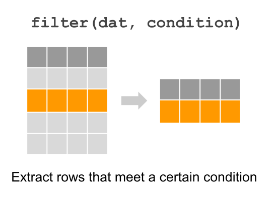

```{r include=FALSE}
library(dplyr)
library(ggplot2)
```


## Exploratory Data Analysis with `dplyr`

We want you to get your hands dirty in R as quick as possible, and perhaps the 
best way to do this is by jumping right away into the pool. You'll have your 
first contact with tabular data (data arranged in rows and columns) which is 
the most common format in which data is handled for data analysis.

To keep things fiarly simple, we use a data set that comes in one the most
popular R packages for manipulation of tables: `"dplyr"`. The main reason to
start in this mode, is to avoid having to worry about data importing issues, 
which we cover later in the course. The other reason is to have data that is
already clean and ready to be analyzed. You will also have time to learn tools
and skills for cleaning data sets in the next weeks.


### Manipulating tables with `"dplyr"` framework

You will start learning a couple of approaches to manipulate tables and create 
basic statistical graphics. To manipulate tables, we are going to use the 
functionality of the package `"dplyr"`. This package allows you to work with 
tabular data _in a syntactic way_.

Later in the course you will also have the opportunity to learn more _low-level_
manipulation tasks.

We are assuming that you already installed the package `"dplyr"`. If that's not 
the case then __run on the console__ the command below 
(do NOT include this command in any `Rmd` file or `jupyter` notebook):

```r
# don't include this command in any Rmd file
# don't worry too much if you get a warning message
install.packages("dplyr")
```
 
Remember that you only need to install a package once! After a package has been 
installed in your machine, there is no need to call `install.packages()` again 
on the same package. What you should always invoke, in order to use the 
functions in a package, is the `library()` function:

```{r eval=FALSE}
# (you should include this command in your Rmd file)
library(dplyr)
```

__About loading packages:__ Another rule to keep in mind is to always load any 
required packages at the very top of your script files (`.R` or `.Rmd` or 
`.Rnw` files). Avoid calling the `library()` function in the middle of a script. 
Instead, load all the packages before anything else.


## Atlantic Hurricane Data

The package `"dplyr"` contains a dataset called `storms` 
which is a subset of the NOAA Atlantic hurricane database best track data.
This database is one of several data sets available in the National Hurricane 
Center (NHC) Data Archive, which is part of the National Oceanic and Atmospheric 
Administration (NOAA). 

<a href="http://www.nhc.noaa.gov/data/#hurdat" target="_blank">http://www.nhc.noaa.gov/data/#hurdat</a>

The data `storms` includes the positions and attributes of 198 tropical storms, 
measured every six hours during the lifetime of a storm. When you type the name 
of the data object, you whould get something like this:

```{r}
storms
```

You can find some technical description of `storms` by taking a peek at its 
manual (or help) documentation: `?storms`.

- `storms` is a __tibble__ object, which is one of the data objects in R that 
handles data in tabular format. 

- tibbles are not a native R object---they come from the homonym package 
`"tibble"`---instead they are a modern version of data frames

The way tibbles are _printed_ is very interesting. 

- the number of rows that are displayed is limited to 10; 

- depending on the width of the printing space, you will only see a few columns 
shown to fit such width. 

- underneath the name of each column there is a three letter abbreviation 
inside angle brackets

- this abbreviation indicates the _data type_ used by R to store the values. For 
  + `<chr>` stands for _character_ data
  + `<dbl>` means double (i.e. real numbers or numbers with decimal digits)
  + `<int>` means integer (numbers with no decimal digits)
  + `<ord>` indicates an _ordinal_ `factor` which is how R handles categorical
  data


### Your Turn

Take a look at the manual (or _help_) documentation of `storms` (see command 
below). Find the description of the variables in data `storms`

```
?storms
```


## Exploratory Data Analysis

Recall the diagram of the Data Analysis Cycle:

```{r fig.cap='Exploratory Data Analysis in DAC', echo = FALSE, out.width='55%'}
knitr::include_graphics("../images/eda/eda-dac.svg")
```

Exploring data is one of those tasks that you will use in both the Data 
Preparation stage and the Core Analysis stage. EDA has a main purpose: 
__get to know your data.__ 
EDA is very similar to when you go to the doctor and they do an 
initial exploration (measure your height, your weight, temperature, blood 
pressure; listen to your heart and lungs; look at your eyes, throat, ears; 
ask you questions about your eating habits, physical activity habits, etc).

To keep things relatively simple, we won't perform a full exploration of every 
single variable (i.e. column) in the data. However, we encourage you to play 
with the functions to go beyond what we cover in this module. In real life,
you will have to do such exploration.


### Basic Inspection of `year`

When you type `storms`, R displays the first 10 rows, which belong to storm
Amy in 1975. In other words, we know that the data contains at least one storm 
from 1975. We also know, from the manual documentation of `storms`, that there 
are supposed to be 198 storms. But we don't know for what years. So in a more 
or less arbitrary way, let's begin inspecting `storms` by focusing on column 
`year`. Our first question is: 

__What years have the data been collected for?__

There are several ways in R to manipulate a column from a tabular object. Using 
`"dplyr"`, there are two basic kinds of functions to extract variables: 
`pull()` and `select()`.

```{r fig.cap='Extracting a column with dplyr functions "pull" and "select"', echo = FALSE, out.width='65%'}
knitr::include_graphics("../images/eda/dplyr-extract-column.svg")
```

Let's do a sanity check of years. We can use the function `pull()` that _pulls_
or extracts an entire column. Because there are 10010 elements in 
`years`, let's also use `unique()` to find out the set of year values in the
data. First we pull the year, and then we identify unique occurrences:

```{r}
unique(pull(storms, year))
```

The same can be accomplished with `select()`. The difference with `pull()` is 
in the way the output is handled by `select()`, which returns output in a table
format:

```{r}
unique(select(storms, year))
```

Based on the previous answers, we can see that `storms` has records during 
a 41-year period since 1975 to 2015.


### Your Turn

- Use `pull()`, `select()`, and `unique()` to inspect the values in column 
`month`

- Try also to use `sort()` in order to arrange the unique values of `month`

- Does the unique month values make sense? Are there months for which there 
seem to be no recorded storms?

- Repeat the same inspection steps with column `day`

- Use `"dplyr"` functions/commands to display the different (unique) types 
of storm `status`.

- Use `"dplyr"` functions/commands to display the different types of  
`category` values.


## Basic inspection of storms in 1975

Let's focus on those storms recorded in 1975. How do we select them? 
Computationally, this operation incolves a logical condition: `year == 1975`.
This condition means that, from all the available year values, we get those 
that match 1975. This is done via `"dplyr"` function `filter()`

```{r fig.cap='Extracting a row with dplyr function "filter"', echo = FALSE, out.width='40%'}

```

First, let's create a subset `storms75` by _filtering_ those rows with `year`
equal to 1975:

```{r}
storms75 <- filter(storms, year == 1975)
storms75
```

Once we have the set of storms that occurred in 1975, one possible question 
to ask is what `unique()` storms happened in that year:

```{r}
unique(pull(storms75, name))
```

From the returned output, there are only three storms recorded in 1975.

A similar result can be obtained with `distinct()`, the difference being the
way in which the output is returned, in this case under the format of a tibble:

```{r}
distinct(storms75, name)
```

Now that we know there are three storms for 1975, it would be nice to count
the number of rows or records for each of them. `"dplyr"` allows us to do this
with `count()`, passing the name of the table, and then the name of the column
for which we want to get the counts or frequencies:

```{r}
count(storms75, name)
```


### Your Turn

- Repeat the previous exploratory steps but now with storms from year 1980.

- Try to find out how to specify a logical condition to filter various years: 
for example, storms from years 1975, 1976, and 1977.

- Try to find out how to specify a logical condition to filter storms from 
year 1975 with `wind` values less than 100.

- Use `"dplyr"` functions/commands to create a table (e.g. tibble) 
`storm_names_1980s` containing the name and year of storms recorded during the 
1980s (i.e. from 1980 to 1989).


## Group-by Operations

Another common task when exploring data has to do with computations applied 
on certain groups or categories of data. `"dplyr"` provides the function 
`group_by()` which takes a data table, and we specify the column(s) on which
rows will be grouped by:

```{r fig.cap='Group-by operations', echo = FALSE, out.width='80%'}
knitr::include_graphics("../images/eda/dplyr-group-by.svg")
```

For example, we may be interested in calculating the average `wind` speed and 
average `pressure` of each storm in 1975. First we need to group by `name`, 
and then we use `summarise()` to indicate that we want to get the `mean()` 
of `wind` and `pressure`, like this:

```{r}
summarise(
  group_by(storms75, name),
  avg_wind = mean(wind),
  avg_pressure = mean(pressure)
)
```

Sometimes, you'll find convenient to assign the output into its own table:

```{r}
avg_wind_pressure_75 <- summarise(
  group_by(storms75, name),
  avg_wind = mean(wind),
  avg_pressure = mean(pressure)
)
```


### Your Turn

- Use `"dplyr"` functions/commands to create a table (e.g. tibble) 
`max_wind_pressure_75` containing columns: 1)`name` of 
storm, 2) `max_wind` maximum wind speed, and 3) `max_pressure` maximum pressure

- Use `"dplyr"` functions/commands to create a table (e.g. tibble) 
`wind_stats_75` containing columns: 1)`name` of 
storm, 2) `min_wind` minimum wind speed, 3) `avg_wind` mean wind speed,
4) `med_wind` median wind speed, and 5) `max_wind` maximum wind speed.


## Arrange operations

The table of summary means `avg_wind_pressure_75` is ordered alphabetically by 
`name`. But perhaps you may want to organize its contents by `avg_wind` or by
`avg_pressure`. Let's see how to do this in the next subsection.

Besides `group_by()` operations, another common type of manipulation is the 
arragement of rows based on the values of one or more columns. In `"dplyr"`, 
this can easily be achieved with the function `arrange()`. The way this function 
works is passing the name of the table, and then specifying one or more columns
to order rows based on such values.

```{r fig.cap='Arranging rows', echo = FALSE, out.width='85%'}
knitr::include_graphics("../images/eda/dplyr-arrange.svg")
```

Say you want to arrange the contents of the average summary table, by taking 
into account the columnd `avg_wind`:

```{r}
arrange(avg_wind_pressure_75, avg_wind)
```

Likewise, you can also arrange the averages by `avg_pressure`:

```{r}
arrange(avg_wind_pressure_75, avg_pressure)
```

The default behavior of `arrange()` is to organize rows in increasing order.
But what if you want to organize rows in decreasing order? No problem, just 
use the auxiliary function `desc()` to indicate that rows should be arranged 
decreasingly:

```{r}
arrange(avg_wind_pressure_75, desc(avg_wind))
```


### Inspecting 1975 storm Amy

Let's focus on a specific storm, for example storm `Amy` in 1975. For sake of 
simplicity, we are going to create a table `amy75` containing the values of 
this storm:

```{r}
amy75 <- filter(storms75, name == "Amy")
amy75
```

Here's a coupe of questions that we could investigate:

- which are the `status` categories for Amy?
- during which months was Amy active? and for how many days?
- what are the basic summary statistics for `wind` and `pressure`?

```{r}
# which are the `status` categories for Amy?
distinct(amy75, status)
```

```{r}
# during which months was Amy active?
distinct(amy75, month)
```

```{r}
# for how many days was Amy active?
count(distinct(amy75, day))
```

```{r}
# summary statistics for wind
summary(select(amy75, wind))
```

```{r}
# summary statistics for pressure
summary(select(amy75, pressure))
```


### Summary

So far, we've covered several functions from `"dplyr"`, as well as some other
functions in R:

- functions from `"dplyr"`
    - `pull()` and `select()`
    - `filter()`
    - `group_by()`
    - `arrange()` and `desc()`
    - `count()`, `distinct()`, `summarise()`
- functions in base R
    - `unique()`, `sort()`, `mean()`, `summary()`


### Your Turn

__1)__ Use `"dplyr"` functions/commands to create a table (e.g. tibble) 
`storms_per_year` containing the number of storms recorded in each year 
(i.e. counts or frequencies of storms in each year). This table should contain 
two columns: year values in the first column, and number of storms in the 
second column.

__2)__ Use `"dplyr"` functions/commands to create a table (e.g. tibble) `storm_records_per_year` containing three columns: 1) `name` of storm, 2) `year` 
of storm, and 3) `count` for number of records (of the corresponding 
storm).

__3)__ Use `"dplyr"` functions/commands to create a table (e.g. tibble) 
`storms_categ5` containing the name and year of those storms of category 5. 

__4)__ Use `"dplyr"` functions/commands to display a table showing the `status`, 
`avg_pressure` (average pressure), and `avg_wind` (average wind speed), for 
each type of storm `category`. This table should contain four columns: 1) 
`category`, 2) `status`, 3) `avg_pressure`, and 4) `avg_wind`.

__5)__ Use `"dplyr"` functions/commands to create a table (e.g. tibble) 
`max_wind_per_storm` containing three columns: 1) `year` of storm, 2) `name` of 
storm, and 3) `max_wind` maximum wind speed record (for that storm).

__6)__ Use `"dplyr"` functions/commands to create a table (e.g. tibble) 
`max_wind_per_year` containing three columns: 1) `year` of storm, 2) `name` of 
storm, and 3) `wind` maximum wind speed record (for that year). Arrange rows by 
wind speed in decreasing order.
