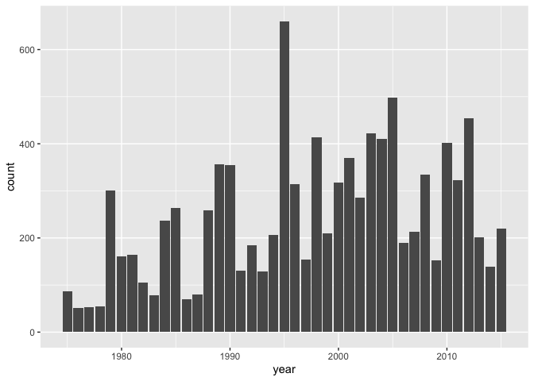
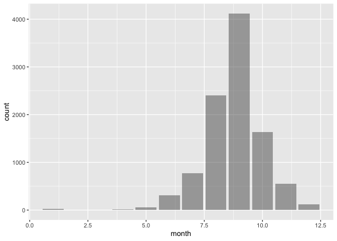
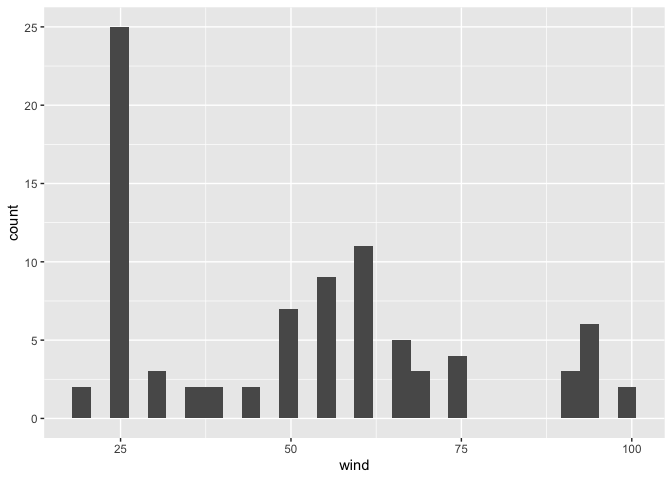
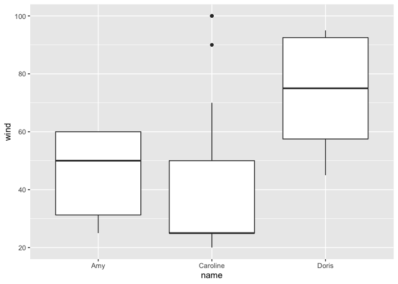
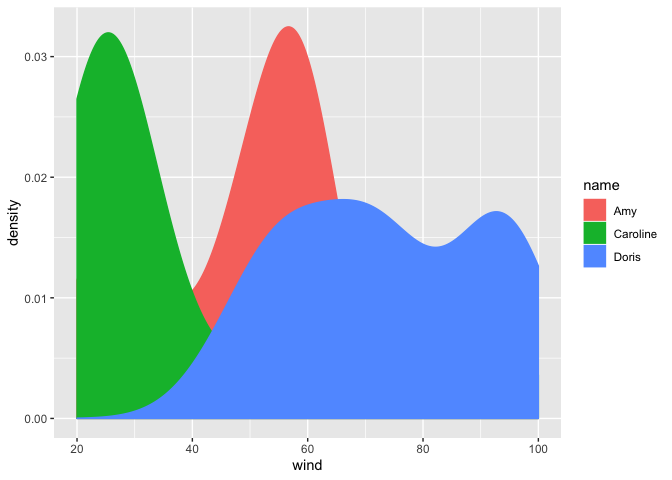
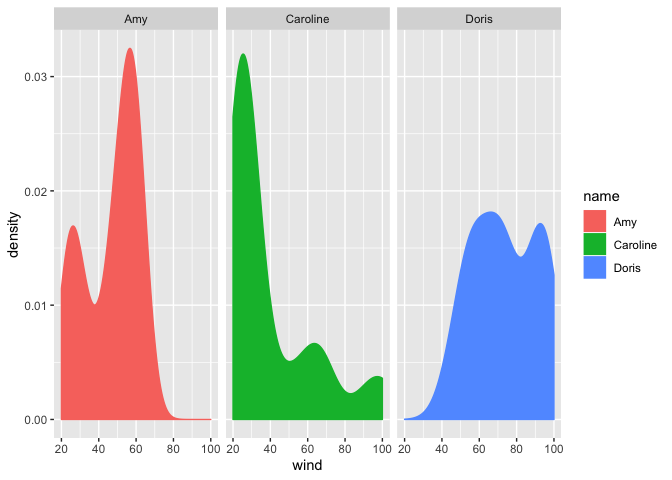
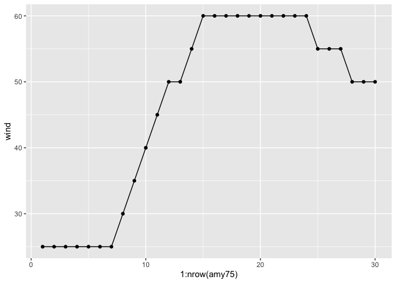
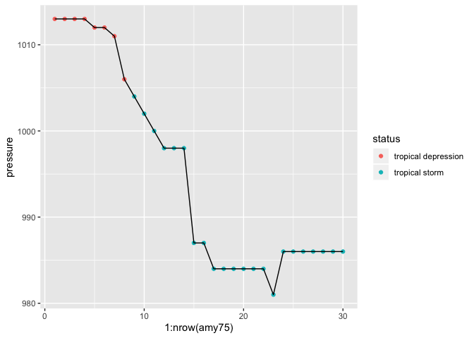
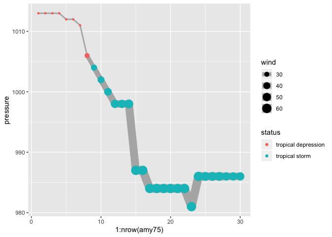

Day 2.1: Hurricanes Data
================

## Introduction

In this part you will start learning how to create graphics in a fairly
consistent and visually pleasant way in R. To do this, we are going to
use the package `"ggplot2"`.

We are assuming that you already installed the package `"ggplot2"`. If
that’s not the case then **run on the console** the command below (do
NOT include this command in an `Rmd` file):

``` r
# don't include this command in Rmd files
# don't worry too much if you get a warning message
install.packages("ggplot2")
```

As we mentioned before, you should invoke the `library()` function to
load the required packages:

``` r
# (you should include this command in your Rmd file, or other source files)
library(ggplot2)
library(dplyr)   
```

### Atlantic Hurricane Data

In the previous part, we began exploration of Atlantic Hurricane Data.
The data set comes in the R package `"dplyr"` under the name `storms`:

``` r
# data from package "dplyr"
storms
```

    ## # A tibble: 10,010 x 13
    ##    name   year month   day  hour   lat  long status category  wind pressure
    ##    <chr> <dbl> <dbl> <int> <dbl> <dbl> <dbl> <chr>  <ord>    <int>    <int>
    ##  1 Amy    1975     6    27     0  27.5 -79   tropi… -1          25     1013
    ##  2 Amy    1975     6    27     6  28.5 -79   tropi… -1          25     1013
    ##  3 Amy    1975     6    27    12  29.5 -79   tropi… -1          25     1013
    ##  4 Amy    1975     6    27    18  30.5 -79   tropi… -1          25     1013
    ##  5 Amy    1975     6    28     0  31.5 -78.8 tropi… -1          25     1012
    ##  6 Amy    1975     6    28     6  32.4 -78.7 tropi… -1          25     1012
    ##  7 Amy    1975     6    28    12  33.3 -78   tropi… -1          25     1011
    ##  8 Amy    1975     6    28    18  34   -77   tropi… -1          30     1006
    ##  9 Amy    1975     6    29     0  34.4 -75.8 tropi… 0           35     1004
    ## 10 Amy    1975     6    29     6  34   -74.8 tropi… 0           40     1002
    ## # … with 10,000 more rows, and 2 more variables: ts_diameter <dbl>,
    ## #   hu_diameter <dbl>

## First contact with `ggplot()`

The package `"ggplot2"` is probably the most popular package in R to
create *beautiful* static graphics. Compared to the functions in the
base package `"graphics"`, the package `"ggplot2`" follows a somewhat
different philosophy, and it tries to be more consistent and modular as
possible.

  - The main function in `"ggplot2"` is `ggplot()`.

  - The main input to `ggplot()` is a data table object (`data.frame` or
    `tibble`).

  - You use the internal function `aes()` to specify what columns of the
    data table will be used as visual attributes of graphical elements
    in your plot.

  - You must specify what kind of *geometric objects* or **geoms** will
    be displayed: e.g. `geom_point()`, `geom_bar()`, `geom_boxpot()`.

  - Pretty much anything else that you want to add to your plot is
    controlled by auxiliary functions, especially those things that have
    to do with the format, rather than the underlying data,
    e.g. `labels()`, `theme()`.

  - The construction of a ggplot is done by *adding layers* with the `+`
    operator.

You may want to take a look at ggplot cheatsheet:

<https://rstudio.com/wp-content/uploads/2015/03/ggplot2-cheatsheet.pdf>

### Barplots

Our first visualization is based on the values of column `year`. You can
certainly begin a visual exploration of other variables, but we think
`year` is a good place to start because it’s a numeric variable,
measured on a discrete scale, and this is a good candidate to use
barcharts (the most popular type of graphic).

`"ggplot2"` comes with a large number of functions to create almost any
type of chart. Luckily for us, it already comes with predefined
functions to graph barcharts. The syntax may seem a bit scary for
beginners, but you will see that it follows a logical structure. Here’s
the code to make a barplot of values in `year`:

``` r
ggplot(data = storms) + 
  geom_bar(aes(x = year))
```

<!-- -->

How does the previous command work?

  - First we always call the `ggplot()` function, typically indicating
    the name of the table to be used with the `data` argument.

  - Then, we add more components, or **layers**, using the plus `+`
    operator.

  - In this case we are adding just one layer: a `geom_bar()` component
    which is the geometric object for bars.

  - To tell `ggplot()` that `year` is the column in `data` to be used
    for the x-axis, we **map** `x = year` inside the `aes()` function
    which stands for *aesthetic* mapping.

We should clarify that the meaning of “aesthetic” as used by `"ggplot2"`
does not mean beautiful or pretty, instead it conserves its etimological
meaning of *perception*. Simply put, `aes()` is the function that you
use to tell `ggplot()` which variables of a `data` object will be mapped
as visual attributes of graphical elements.

Now that we’ve created our first graphic with `ggplot()`, let’s spend a
moment looking at the graph, and decoding what is being displayed. Let’s
focus on the very first bar, the one that corresponds to year 1975. It
seems to have a height of a little less that 100. Actually, from last
chapter, we know that there are 86 records (or rows) for 1975. In case
you are curious, here’s a command that gives us this information:

``` r
nrow(filter(storms, year == 1975))
```

    ## [1] 86

What about 1979?

``` r
nrow(filter(storms, year == 1979))
```

    ## [1] 301

This number matches the height of the bar for 1979. Essentially, the
barchart is displaying counts in the y-axis that represent the number of
records for all storms in each year. While this information is somewhat
interesting, a more meaningful output would be the number of storms in
each year (not the total number of records per year, but the number of
storms per year). We’ll tackle this problem in the next subsection.

### Your Turn

  - Look at the cheatsheet for ggplot and locate the information for
    `geom_bar()`. Find out how to specify: border `color`, `fill` color.
    Also, see what happens when you specify `alpha = 0.5`.

  - Look at the cheatsheet for ggplot and locate the information for
    background *Themes*, e.g. `theme_bw()`. Find out how to add theme
    `theme_classic()` to the previous barchart.

  - Look at the cheatsheet for ggplot and locate the information for
    *Labels*. Find out how to add a title with `ggtitle()` as well as
    with `labs()` to one of your previous barchart.

  - Create a barchart of `month` values. Does the plot make sense?

<!-- end list -->

``` r
ggplot(storms) +
  geom_bar(aes(x = month), alpha = 0.5)
```

<!-- -->

  - Create again a barchart of `month` but this time use `aes(x =
    factor(month))` to indicate R that this variable should be treated
    as a `factor` (i.e. categorical variable).

### Number of Storms per Year

In the previous barchar for `year`, we discovered the 41-year period or
recorded data from 1975 to 2015. We can take a further step and ask: how
many storms are there in each year?

To answer this question, we need to do some data manipulation with
`"dplyr"`. Our general recommendation when working with `"dplyr"`’s
functions, especially when you are learning about them, is to do
computations step by step, deciding which columns you need to use, which
rows to consider, which functions to call, and so on.

Think about the columns that we need to select to find the number of
storms per year. We obviously need `year`, but this column alone it’s
not enough because for any given storm we have multiple records with the
same year. Therefore, we also need column `name`.

For illustration purposes, we are going to build the data manipulation
pipeline step by step. As you get more comfortable with `"dplyr"` and
other functions, you won’t have the need to disect every single command.
A first step is to `select()` variables `year` and `name`:

``` r
select(storms, year, name)
```

    ## # A tibble: 10,010 x 2
    ##     year name 
    ##    <dbl> <chr>
    ##  1  1975 Amy  
    ##  2  1975 Amy  
    ##  3  1975 Amy  
    ##  4  1975 Amy  
    ##  5  1975 Amy  
    ##  6  1975 Amy  
    ##  7  1975 Amy  
    ##  8  1975 Amy  
    ##  9  1975 Amy  
    ## 10  1975 Amy  
    ## # … with 10,000 more rows

Next, we need to `group_by()` year. At first glance, the previous output
and the output below seem identical. But notice the tiny difference: the
output below has a second line of text with some relevant information:
`# Groups: year [41]`, telling us that the values are grouped by year.

``` r
group_by(select(storms, year, name), year)
```

    ## # A tibble: 10,010 x 2
    ## # Groups:   year [41]
    ##     year name 
    ##    <dbl> <chr>
    ##  1  1975 Amy  
    ##  2  1975 Amy  
    ##  3  1975 Amy  
    ##  4  1975 Amy  
    ##  5  1975 Amy  
    ##  6  1975 Amy  
    ##  7  1975 Amy  
    ##  8  1975 Amy  
    ##  9  1975 Amy  
    ## 10  1975 Amy  
    ## # … with 10,000 more rows

Then, we identify the `distinct()` values (combination of year-name):

``` r
distinct(group_by(select(storms, year, name), year))
```

    ## # A tibble: 426 x 2
    ## # Groups:   year [41]
    ##     year name    
    ##    <dbl> <chr>   
    ##  1  1975 Amy     
    ##  2  1975 Caroline
    ##  3  1975 Doris   
    ##  4  1976 Belle   
    ##  5  1976 Gloria  
    ##  6  1977 Anita   
    ##  7  1977 Clara   
    ##  8  1977 Evelyn  
    ##  9  1978 Amelia  
    ## 10  1978 Bess    
    ## # … with 416 more rows

For convenience purposes, let’s assign this table into its own object,
which we can call `storms_year_name`

``` r
storms_year_name <- distinct(group_by(select(storms, year, name), year))
```

Finally, we need to `count()` how many storms are in each year:

``` r
count(storms_year_name, year)
```

    ## # A tibble: 41 x 2
    ## # Groups:   year [41]
    ##     year     n
    ##    <dbl> <int>
    ##  1  1975     3
    ##  2  1976     2
    ##  3  1977     3
    ##  4  1978     4
    ##  5  1979     7
    ##  6  1980     8
    ##  7  1981     5
    ##  8  1982     5
    ##  9  1983     4
    ## 10  1984    10
    ## # … with 31 more rows

All the previous commands can be assembled together with various
embedded lines of code:

``` r
storms_per_year <- count(
  distinct(
    group_by(
      select(storms, year, name), 
      year)
    )
  )

storms_per_year
```

    ## # A tibble: 41 x 2
    ## # Groups:   year [41]
    ##     year     n
    ##    <dbl> <int>
    ##  1  1975     3
    ##  2  1976     2
    ##  3  1977     3
    ##  4  1978     4
    ##  5  1979     7
    ##  6  1980     8
    ##  7  1981     5
    ##  8  1982     5
    ##  9  1983     4
    ## 10  1984    10
    ## # … with 31 more rows

Now that we have the counts or frequencies, we can make our next
barchart. In this case, we will use the table `storms_year_name` as the
input data for `ggplot()`:

``` r
ggplot(data = storms_year_name) + 
  geom_bar(aes(x = year))
```

<!-- -->

By looking at the chart, there are some fairly tall bars. Although it’s
hard to see exactly which years have a considerably large number of
storms, eyeballing things out it seems that around 1995, 2003, 2005, and
2010 there are 20 or more storms. We can find the actual answer by using
`arrange()`, specifying the counts to be shown in descending order—with
`desc()`:

``` r
arrange(storms_per_year, desc(n))
```

    ## # A tibble: 41 x 2
    ## # Groups:   year [41]
    ##     year     n
    ##    <dbl> <int>
    ##  1  1995    21
    ##  2  2005    21
    ##  3  2003    20
    ##  4  2010    20
    ##  5  2001    17
    ##  6  2012    17
    ##  7  2000    16
    ##  8  2007    16
    ##  9  2011    15
    ## 10  2008    14
    ## # … with 31 more rows

As you can tell, in the 41-year period from 1975 to 2015, there are two
years, 1995 and 2005, with a maximum number of storms equal to 21.

### Storms in 1975

Like we did in the previous part, let’s play a bit with those storms
from 1975. More specifically, let’s visually explore the values of
`wind` and `pressure`.

``` r
storms75 <- filter(storms, year == 1975)
storms75
```

    ## # A tibble: 86 x 13
    ##    name   year month   day  hour   lat  long status category  wind pressure
    ##    <chr> <dbl> <dbl> <int> <dbl> <dbl> <dbl> <chr>  <ord>    <int>    <int>
    ##  1 Amy    1975     6    27     0  27.5 -79   tropi… -1          25     1013
    ##  2 Amy    1975     6    27     6  28.5 -79   tropi… -1          25     1013
    ##  3 Amy    1975     6    27    12  29.5 -79   tropi… -1          25     1013
    ##  4 Amy    1975     6    27    18  30.5 -79   tropi… -1          25     1013
    ##  5 Amy    1975     6    28     0  31.5 -78.8 tropi… -1          25     1012
    ##  6 Amy    1975     6    28     6  32.4 -78.7 tropi… -1          25     1012
    ##  7 Amy    1975     6    28    12  33.3 -78   tropi… -1          25     1011
    ##  8 Amy    1975     6    28    18  34   -77   tropi… -1          30     1006
    ##  9 Amy    1975     6    29     0  34.4 -75.8 tropi… 0           35     1004
    ## 10 Amy    1975     6    29     6  34   -74.8 tropi… 0           40     1002
    ## # … with 76 more rows, and 2 more variables: ts_diameter <dbl>,
    ## #   hu_diameter <dbl>

What type of visual display can we use to graph `wind` speed? The answer
to this question is based by determining which type of variable `wind`
is. You would agree with us in saying that `wind` is a quantitative
variable. So one graphing option can be either a histogram or a boxplot,
which are statistical charts to visualize the distribution of
quantitative variables.

So let’s use `geom_histogram()` and see what we get. We are going to
show you a synatx of `ggplot()` slightly different from the one we used
for the barcharts. Carefully review the following code:

``` r
ggplot(data = storms75, aes(x = wind)) +
  geom_histogram()
```

    ## `stat_bin()` using `bins = 30`. Pick better value with `binwidth`.

<!-- -->

You should notice now that `aes()` is an argument of `ggplot()`, and not
anymore an argument of the geometric-object function `geom_histogram()`.
While this may be a bit confusing when learning about `"ggplot2"`, it is
a very flexible and powerful behavior of `aes()`. Again, the important
part of `aes()` is to understand that this function allows you to tell
`ggplot()` which variables in your `data` table are used as visual
attributes of the corresponding geometric elements forming the plot.

We can change the default argument `binwidth` to get another version of
the histogram, for example a bin-width of 5 units (i.e. width of 5
knots):

``` r
ggplot(data = storms75, aes(x = wind)) +
  geom_histogram(binwidth = 5)
```

<!-- -->

or a bin-width of 10:

``` r
ggplot(data = storms75, aes(x = wind)) +
  geom_histogram(binwidth = 10)
```

<!-- -->

Now, let’s reflect on what’s going on in each of the histograms. Do they
make sense? How do we interpret each figure?

While `ggplot()` does what we ask it to do, the displays may not be the
most useful, or meaningful. Why? Think what exactly it is that we are
plotting. In 1975, there are three storms:

``` r
unique(pull(storms75, name))
```

    ## [1] "Amy"      "Caroline" "Doris"

But the histograms are not differentiating between any of those three
storms. Rather, the visualization is just giving us a general view of
the `wind` values, from the low 20’s to the high 90’s, or to be more
precise:

``` r
summary(pull(storms75, wind))
```

    ##    Min. 1st Qu.  Median    Mean 3rd Qu.    Max. 
    ##   20.00   25.00   52.50   50.87   65.00  100.00

However, we don’t really know if all three storms have the same minimum
`wind` speed, or the same maximum `wind` speed. The good news is that we
can tell `ggplot()` to take into account each different storm name. But
now let’s use boxplots via `geom_boxplot()`, mapping `name` to the
x-axis, and `wind` to the y-axis.

``` r
ggplot(data = storms75, aes(x = name, y = wind)) +
  geom_boxplot()
```

<!-- -->

Note how different the distribution of wind speed is in each storm. We
can get an alternative plot with density curves thanks to the
`geom_density()` function. The syntax in this case is different. Let’s
first do it without separating storms, and then we do it taking into
account the storm names.

Here’s the command that plots a density curve of wind, without
distinguishing between storms. Observe also how argument `fill` is *set*
to color `'gray'`:

``` r
ggplot(data = storms75, aes(x = wind)) +
  geom_density(fill = 'gray')
```

<!-- -->

As you can tell, the density curve looks like the profile of a roller
coaster, or like the silhouette of three mountain peaks. Is this a
pattern followed by wind speed in all storms? Or is it just an artifact
due to the fact that we are plotting data without taking into
consideration the context of `storms75`?

Let’s replot density of wind, but now distinguishing between each storm.
We do this by mapping `name` to the `color` argument:

``` r
ggplot(data = storms75, aes(x = wind, color = name)) +
  geom_density(aes(fill = name))
```

<!-- -->

Now things look more interesting: the roller coast shape of the first
call to `geom_density()` turned out to be an artificial pattern. As you
can tell from the above plot, each storm has its own density curve.

To get a better visualization, we can take the previous command and add
a bit of transparency to the colors, this is done with the argument
`alpha` inside `geom_density()`. Note how arguments are specified inside
`geom_density()`: we **map** `name` to the color-fill attribute of the
curve using `aes()`, but we **set** `alpha = 0.5` outside `aes()`:

``` r
ggplot(data = storms75, aes(x = wind, color = name)) +
  geom_density(aes(fill = name), alpha = 0.5)
```

<!-- -->

We are going to take advantage of this graphic to introduce another cool
feature of `"ggplot2"` that allows us to split data based on categorical
or discrete variables, in order to produce separated frames or
**facets**. Here’s the command previous command—wihtout `alpha`
transparency—adding a new layer given by `facet_wrap()`:

``` r
ggplot(data = storms75, aes(x = wind, color = name)) +
  geom_density(aes(fill = name)) + 
  facet_wrap(~ name)
```

<!-- -->

In this command we are faceting by `name`, and this does is to create
facets, one for each category of `name`. In other words, we get
separated density curves, one for each storm. The syntax inside
`facet_wrap()` uses the tilde `~` operator which is the *formula*
operator in R. Basically, the command `~ name` tells `ggplot()` to
create facets based on the values of `name`.

### Visual Inspection of Amy 1975

As we did it in the previous chapter, let’s focus on storm `Amy` in
1975, subsetting `storms75` to filter out just the rows of Amy into its
own table

``` r
amy75 <- filter(storms75, name == "Amy")
amy75
```

    ## # A tibble: 30 x 13
    ##    name   year month   day  hour   lat  long status category  wind pressure
    ##    <chr> <dbl> <dbl> <int> <dbl> <dbl> <dbl> <chr>  <ord>    <int>    <int>
    ##  1 Amy    1975     6    27     0  27.5 -79   tropi… -1          25     1013
    ##  2 Amy    1975     6    27     6  28.5 -79   tropi… -1          25     1013
    ##  3 Amy    1975     6    27    12  29.5 -79   tropi… -1          25     1013
    ##  4 Amy    1975     6    27    18  30.5 -79   tropi… -1          25     1013
    ##  5 Amy    1975     6    28     0  31.5 -78.8 tropi… -1          25     1012
    ##  6 Amy    1975     6    28     6  32.4 -78.7 tropi… -1          25     1012
    ##  7 Amy    1975     6    28    12  33.3 -78   tropi… -1          25     1011
    ##  8 Amy    1975     6    28    18  34   -77   tropi… -1          30     1006
    ##  9 Amy    1975     6    29     0  34.4 -75.8 tropi… 0           35     1004
    ## 10 Amy    1975     6    29     6  34   -74.8 tropi… 0           40     1002
    ## # … with 20 more rows, and 2 more variables: ts_diameter <dbl>,
    ## #   hu_diameter <dbl>

Let’s keep exploring `wind` but now let’s do it chronologically, that
is, graphing the wind values in the order that they were recorded
(recall storms are tracked every six hours). We begin with a scatterplot
using `geom_point()`, and we specify that the x-axis should use a
numeric sequence from the first row till the last row of `amy75`, and
`wind` for y-axis:

``` r
ggplot(data = amy75, aes(x = 1:nrow(amy75), y = wind)) +
  geom_point()
```

<!-- -->

Becasue the x-axis denotes progression over time, we can connect the
dots with a line. A simple way to do this is by adding another layer to
our plot, this time with `geom_line()`

``` r
ggplot(data = amy75, aes(x = 1:nrow(amy75), y = wind)) +
  geom_point() + 
  geom_line()
```

<!-- -->

As you can tell, Amy started to being recorded with wind speed of 25
knots, and then after 42 hours (7 x 6) its speed kept increasing to 30,
35, 40, and so on until reaching its maximum speed of 60 knots that
lasted 54 hours (9 x 6).

At this point, we can ask about the `status` of Amy along its lifetime.
One option is to map `status` to the `color` attribute of points:

``` r
ggplot(data = amy75, aes(x = 1:nrow(amy75), y = wind)) +
  geom_point(aes(color = status)) + 
  geom_line()
```

<!-- -->

We see that Amy started as a tropical depression, and then became a
tropical storm, but never became a hurricane. For a storm to reach
hurricane status, of category 1, it must have one-minute maximum
sustained winds of at least 64 kn (33 m/s; 74 mph; 119 km/h).

What about the pressue values fo Amy? We can produce a similar
scatterplot with a line connecting the dots:

``` r
ggplot(data = amy75, aes(x = 1:nrow(amy75), y = pressure)) +
  geom_point(aes(color = status)) + 
  geom_line()
```

<!-- -->

As an exploratory exercise, we can also play with the size of points,
the size (width) of lines, colors, etc. Here’s one suggestion graphing
`pressure` and taking into account the `wind` speed reflected in the
size of points and line segments:

``` r
ggplot(data = amy75, aes(x = 1:nrow(amy75), y = pressure)) +
  geom_line(aes(size = wind), lineend = "round", color = 'gray70') +
  geom_point(aes(size = wind, color = status))
```

<!-- -->

If you know a little bit about storms, you know there’s actually an
association between `wind` and `pressure`. But let’s pretend for a
second that we don’t know much about tropical storms, hurricanes, and
things like that. By looking at the previous chart, this should allows
us to guess that something is going on between the `pressure` of a storm
and its `wind` speed. As Amy becomes stronger, with higher winds, its
pressure levels drop accordingly, suggesting a negative correlation,
which is confirmed when we compute this statistic:

``` r
summarise(amy75, cor(wind, pressure))
```

    ## # A tibble: 1 x 1
    ##   `cor(wind, pressure)`
    ##                   <dbl>
    ## 1                -0.956

## Exercises

**1)** Use `"ggplot2"` functions to make a single scatterplot of `wind`
and `pressure` for all storms. Use `category` to add color to the dots.

**2)** Use `"ggplot2"` functions to make a scatterplot of `wind` and
`pressure` for all storms, facetting by month, and using `category` to
differentiate by color.

**3)** Use `"ggplot2"` functions to make a scatterplot of `wind` and
`pressure` for all storms, but now create facets based on `month`. Feel
free to add some amount of `alpha` transparency to the color of dots.

**4)** Create boxplots of pressure, for storms in 1980. You can also try
graphing *violins* (`geom_violin()`) instead of boxplots
(`geom_boxplot()`).

**5)** Make a scatterplot of `wind` (x-axis) and `ts_diameter` (y-axis),
and add a regression line—via `geom_smooth()`.

1)  Try `geom_smooth()` with `method = lm` to fit a least squares
    regression line.

2)  Try `geom_smooth()` with `method = loess` to fit a local polynomial
    regression.

**6)** Repeat the previous scatterplot of `wind` (x-axis) and
`ts_diameter` (y-axis), but now use `status` to color code the points,
and use the `alpha` argument to add some transparency to the dots.

**7)** Take a look at the cheatsheet of `"ggplot2"` and make at least 5
more different graphs (e.g. of one variable, of two variables, of three
variables).
