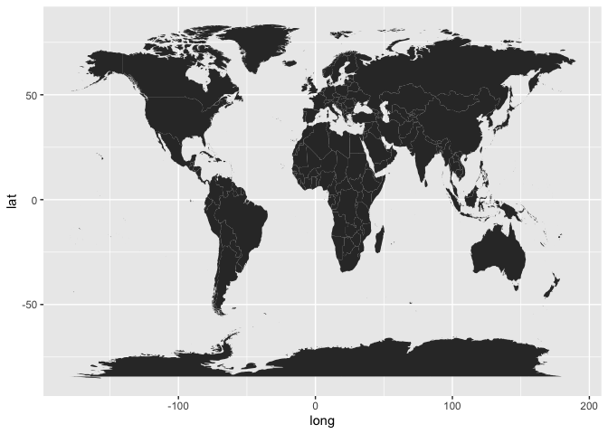
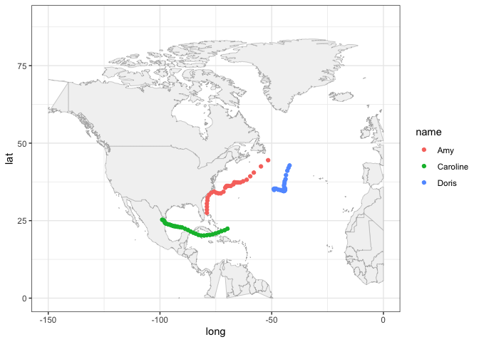
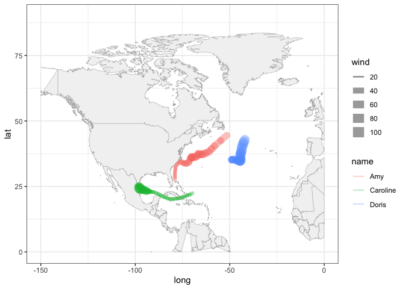
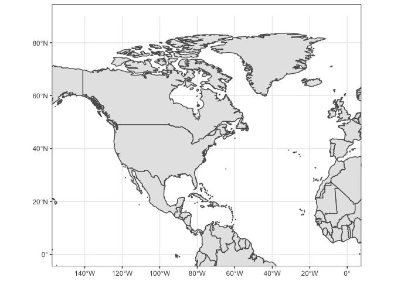
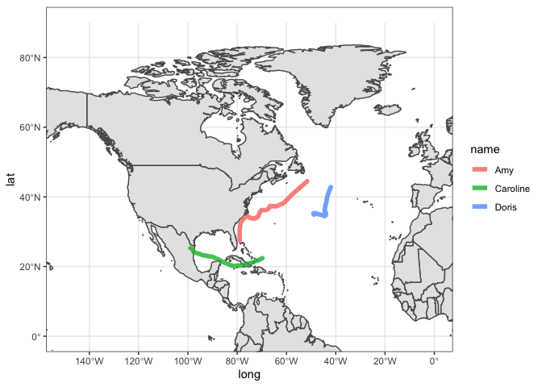

Day 2.2): Mapping Hurricanes
================

## Basic Geospatial EDA

In the previous parts, you were introduced to the basics of `"dplyr"`
and `"ggplot2"`, performing various operations on the data `storms`.
Because this data set contains geographical information such as
longitude and latitude, we take a further step in this chapter in order
to learn about plotting basic geographical maps.

You will need the following packages:

``` r
library(dplyr)    # for syntactic manipulation of tables
library(ggplot2)  # for making graphs based on tabular data
library(maps)     # for drawing basic geographical maps
library(rnaturalearth)   # world map data from Natural Earth
```

and the following objects:

``` r
storms75 <- filter(storms, year == 1975)
```

## Graphing Maps

In this part, we give a basic exposure to plotting maps with `"ggplot2"`
and `"maps"`. Keep in mind that there is a wide array of packages for
graphing all sorts of maps, and geospatial information. Good resources
to look at are:

  - <a href="https://www.r-spatial.org/r/2018/10/25/ggplot2-sf.html" targe="_blank">Drawing
    beautiful maps programmatically with R, sf and ggplot2</a> (by Mel
    Moreno and Mathieu Basille)

  - <a href="https://geocompr.robinlovelace.net/" target="_blank">Geocomputation
    with R</a> (by Robin Lovelace, Jakub Nowosad, and Jannes Muenchow)

  - <a href="https://eriqande.github.io/rep-res-web/lectures/making-maps-with-R.html" target="_target">Making
    Maps with R</a> (by Eric C. Anderson)

### Plotting location of storm records

For illustration purposes, we continue using the data frame `storms75`.
Having latitude and longitude, we can make a scatterplot to see the
location of the storm records. Recall that the `ggplot` function to do
this is `geom_point()`. To distinguish each storm, we can color the dots
by taking into account the different storm names. This involves
*mapping* the column `name` to the `color` attribute:

``` r
ggplot(data = storms75, aes(x = long, y = lat, color = name)) + 
  geom_point()
```

<!-- -->

Keep in mind that the previous command can also be written as:

``` r
# alternative ways to write equivalent commands
ggplot(data = storms75) +  
  geom_point(aes(x = long, y = lat, color = name))

ggplot() +  
  geom_point(data = storms75, aes(x = long, y = lat, color = name))
```

The above scatterplot is a good starting point to visualize the location
of the storm records, but it would be nice to have an actual image of a
map. Let’s see how to do this in the following subsections.

### Basic map

One of the oldest ways to plot maps in R is with the package `"maps"`.
Nowadays, there are better packages for geospatial data ana making maps,
but let’s not worry about them at this moment.

One rudimentary way to plot a map by first getting data of the world.
`"ggplot2"` provides the function `map_data()` to create the required
data table with geospatial information of a world map. All you have to
do is specify the name of the map provided by the `"maps"` package. In
this example, let’s use the `"world"` map. Once we have this data, we
can use it with `ggplot()` and a `geom_polygon()` layer like this:

``` r
# world map data
world_map <- map_data("world")

# a default world map
ggplot() + 
  geom_polygon(data = world_map, 
               aes(x = long, y = lat, group = group))
```

<!-- -->

In the above command, notice how we specify the `data` argument inside
`geom_polygon()` instead of inside `ggplot()`. We do this because the
data frame `world_map` is used to graph the layer of the map. We still
need to add another layer—via `geom_point()`—for the coordinates
indicating the position of each storm’s record.

To handle the code more easily, let’s modify the map, and create a
`"ggplot"` object called `gg_world`. We’ll use this object as our
“canvas” for plotting the storm locations:

``` r
# map "canvas" stored as gg_world
gg_world <- ggplot() + 
  geom_polygon(data = world_map, 
               aes(x = long, y = lat, group = group), 
               fill = "gray95", colour = "gray70", size = 0.2) +
  theme_bw()

gg_world
```

<!-- -->

Now that we know how to plot a map with `ggplot()`, we can add the
points of the storm records. This is done with `geom_point()`, and
specifying `storms75` as the `data` argument inside this function. In
other words, we are using two separate data frames. One is `world_map`,
used to draw the polygons of the map; the other one is `stomrs75` to
graph the dots of each storm. Notice also that there are no inputs
provided to the function `ggplot()`.

``` r
# world map, adding storms in 1975
gg_world +
  geom_point(data = storms75,
             aes(x = long, y = lat, color = name))
```

<!-- -->

Because the analyzed hurricanes occurred in the North Atlantic basin, we
can focus on that region by modifying the x-and-y axis limits:

``` r
# zoom-in
gg_world +
  geom_point(data = storms75,
             aes(x = long, y = lat, color = name)) +
  xlim(c(-150, 0)) + 
  ylim(c(0, 90))
```

<!-- -->

It’s worth mentioning that this zooming-in has a secondary effect of
distorting some of the polygons. For example, Alaska seems to get cut in
half. Also the polygon of Colombia is incomplete. Ignoring these
distortions for now, we can continue exploring things by taking into
account more variables. For instance, let’s map the `wind` speed to the
`size` argument of points.

``` r
gg_world +
  geom_point(data = storms75,
             aes(x = long, y = lat, color = name, size = wind),
             alpha = 0.5) +
  xlim(c(-150, 0)) + 
  ylim(c(0, 90))
```

<!-- -->

A very similar appearance can be achieved by replacing `geom_point()`
with `geom_path()`:

``` r
gg_world +
  geom_path(data = storms75,
             aes(x = long, y = lat, color = name, size = wind),
             lineend = "round", alpha = 0.4) +
  xlim(c(-150, 0)) + 
  ylim(c(0, 90))
```

<!-- -->

### More mapping approaches

Another interesting map graphing approach is by using map-objects from
the package `"rnaturalearth"`.

We use the `ne_countries()` function—from `"rnaturalearth"`—to get world
country polygons. In the following command, we specify a `medium` scale
resolution, and a returned object of class `"sf"` (simple features).

``` r
# another world data frame
world_df <- ne_countries(scale = "medium", returnclass = "sf")
class(world_df)
```

    ## [1] "sf"         "data.frame"

Now we can pass `world_df` to `ggplot()`, and use `geom_sf()` which is
the function that allows us to visualize *simple features* objects
`"sf"`.

``` r
# another world map (from "rnaturalearth")
ggplot(data = world_df) +
  geom_sf() + 
  theme_bw()
```

<!-- -->

One advantage of using this other mapping approach is that we can
zoom-in without having distorted polygons. To focus on a specfic region,
we set the x-axis and y-axis limits with the `coord_sf()` function.
Again, for coding convenience, let’s create another `"ggplot"` object

``` r
# ggplot object to be used as a canvas
gg_world2 <- ggplot(data = world_df) +
  geom_sf() + 
  coord_sf(xlim = c(-150, 0), ylim = c(0, 90), expand = TRUE) +
  theme_bw()

gg_world2
```

<!-- -->

Now let’s add the storms:

``` r
gg_world2 + 
  geom_path(data = storms75,
            aes(x = long, y = lat, color = name),
            lineend = "round", size = 2, alpha = 0.8)
```

<!-- -->

### Storms from 1975 to 1980

As a simple experiment, let’s graph storms between 1975 and 1980 (six
years). First we create a dedicated data table `storms_75_80` to select
the rows we are interested in:

``` r
storms_75_80 <- filter(storms, year %in% 1975:1980)
```

And then we can use `facet_wrap(~ year)` to graph storms by year:

``` r
gg_world +
  geom_path(data = storms_75_80,
             aes(x = long, y = lat, group = name),
             lineend = "round") +
  xlim(c(-150, 0)) + 
  ylim(c(0, 90)) + 
  facet_wrap(~ year)
```


### Exercises

**1)** Filter storms in the 1980’s decade (1980 - 1989) and make a plot,
with facets by `month` as well as by `year`

  - Which year seems to have the largest number of storms?
  - Which year seems to have the smallest number of storms?
  - Does it seem to be a pattern (e.g. increasing number of storms over
    years)?

**2)** Take the previous data, storms in the 1980’s decade, and make a
plot, with but this time with facets by `month`.

  - What is the most active month?
  - What is the least active month?
  - Are there months without any storms?
