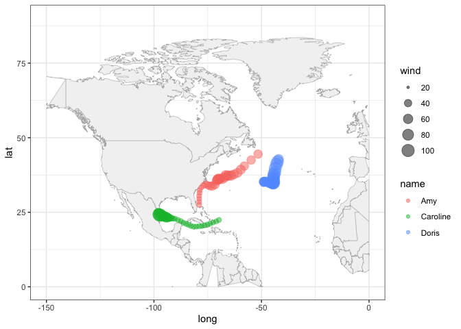

Day 2.2): Mapping Hurricanes
================

## Basic Geospatial EDA

You will need the following packages:

``` r
library(dplyr)
library(ggplot2)
library(maps)
```

and the following objects:

``` r
storms75 <- filter(storms, year == 1975)
```

## Graphing Maps

In this chapter, we give a basic exposure to plotting maps with
`"ggplot2"` and `"maps"`. Keep in mind that there is a wide array of
packages for graphing all sorts of maps, and geospatial information.
Good resources to look at are:

<a href="https://geocompr.robinlovelace.net/" target="_blank">Geocomputation
with R</a> (by Robin Lovelace, Jakub Nowosad, and Jannes Muenchow)

<a href="https://eriqande.github.io/rep-res-web/lectures/making-maps-with-R.html" target="_target">Making
Maps with R</a> (by Eric C. Anderson)

### Plotting location of storm records

Having latitude and longitude, we can make a scatterplot to see the
location of the storm records

``` r
ggplot(data = storms75, aes(x = long, y = lat, color = name)) + 
  geom_point()
```

<!-- -->

This is good, but it would be better to have an actual image of a map.

### Basic map

One of the oldest ways to plot maps in R is with the package `"maps"`.
Nowadays, there are better packages for geospatial data ana making maps,
but let’s not worry about them at this moment.

One rudimentary way to plot a map by first getting data of the world.
`"ggplot2"` provides the function `map_data()` to create the required
data table with geospatial information of a world map. All you have to
do is specify the name of the map provided by the `"maps"` package. In
this example, let’s use the `"world"` map. Once we have this data, we
can use it with `ggplot()` and a `geom_polygon()` layer like this:

``` r
# world map data
world_map <- map_data("world")

# a default world map
ggplot() + 
  geom_polygon(data = world_map, 
               aes(x = long, y = lat, group = group))
```

<!-- -->

In the above command, notice how we specify the `data` argument inside
`geom_polygon()` instead of inside `ggplot()`. We do this because the
data frame `world_map` is used to graph the layer of the map. We still
need to add another layer—via `geom_point()`—for the coordinates
indicating the position of each storm’s record.

For convenience reasons, let’s modify the map, and create a `"ggplot"`
object called `gg_world`. We’ll use this object as our “canvas” for
plotting the storm locations:

``` r
# map "canvas" stored as gg_world
gg_world <- ggplot() + 
  geom_polygon(data = world_map, 
               aes(x = long, y = lat, group = group), 
               fill = "gray95", colour = "gray70", size = 0.2) +
  theme_bw()

gg_world
```

<!-- -->

Then, we can take `gg_world` and add the `geom_point()` layer with data
`storms75` mapping longitude and latitude coordinates, and coloring
points by `name`:

``` r
# world map, adding storms in 1975
gg_world +
  geom_point(data = storms75,
             aes(x = long, y = lat, color = name))
```

<!-- -->

We can try zooming-in by modifying the x-and-y axis limits:

``` r
# zoom-in
gg_world +
  geom_point(data = storms75,
             aes(x = long, y = lat, color = name)) +
  xlim(c(-150, 0)) + 
  ylim(c(0, 90))
```

<!-- -->

And then keep exploring things by taking into account more variables.
For instance, let’s map `wind` to the `size` argument of points.

``` r
gg_world +
  geom_point(data = storms75,
             aes(x = long, y = lat, color = name, size = wind),
             alpha = 0.5) +
  xlim(c(-150, 0)) + 
  ylim(c(0, 90))
```

<!-- -->

A very similar appearance can be achieved with `geom_path()`

``` r
gg_world +
  geom_path(data = storms75,
             aes(x = long, y = lat, color = name, size = wind),
             lineend = "round", alpha = 0.4) +
  xlim(c(-150, 0)) + 
  ylim(c(0, 90))
```

<!-- -->

### Storms from 1975 to 1980

As a simple experiment, let’s graph storms between 1975 and 1980 (six
years). First we create a dedicated data table `storms_75_80` to select
the rows we are interested in:

``` r
storms_75_80 <- filter(storms, year %in% 1975:1980)
```

And then we can use `facet_wrap(~ year)` to graph storms by year:

``` r
gg_world +
  geom_path(data = storms_75_80,
             aes(x = long, y = lat, group = name),
             lineend = "round") +
  xlim(c(-150, 0)) + 
  ylim(c(0, 90)) + 
  facet_wrap(~ year)
```


### Exercises

**1)** Filter storms in the 1980’s decade (1980 - 1989) and make a plot,
with facets by `month.`year\`

  - Which year seems to have the largest number of storms?
  - Which year seems to have the smallest number of storms?
  - Does it seem to be a pattern (e.g. increasing number of storms over
    years)?

**2)** Take the previous data, storms in the 1980’s decade, and make a
plot, with but this time with facets by `month`.

  - What is the most active month?
  - What is the least active month?
  - Are there months without any storms?
