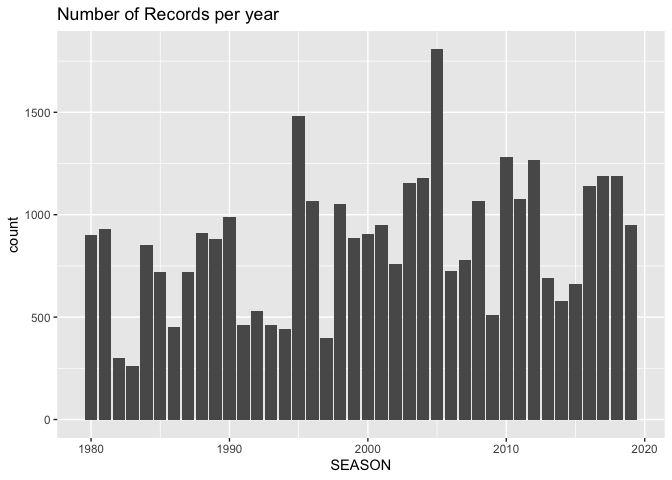

Day 3.2): Analyzing Hurricanes
================

``` r
# used packages
library(dplyr)
library(maps)      
library(ggplot2)
```

## Hurricanes Data

We perform an exploratory analysis of hurricanes data in the North
Atlantic from years 1980 to 2019, focusing on the following research
claims:

1)  A typical hurricane season runs from June through November, but
    occasionally storms form outside those months.

2)  A typical year has 12 named storms, including six hurricanes of
    which three become major hurricanes (category 3, 4, and 5).

3)  September is the most active month (where most of the hurricanes
    occur), followed by August, and October.

4)  No hurricanes made U.S. landfall before June and after November.

## Importing Data

Regardless of the importing approach you decide to use, you have to
import data following these specifications:

  - Import only the first 16 columns (from `SID` to `LANDFALL`)

  - Specify data types for the 16 imported columns as:
    
      - `SEASON`, `NUMBER`, `WMO_WIND`, `WMO_PRES`, `DIST2LAND`, and
        `LANDFALL` must be of type `"integer"`
      - `LAT` and `LON` must be of type `"double"` or `"real"`
      - the rest of the columns must be of type `"character"`

<!-- end list -->

``` r
hurdat <- "data/ibtracs.NA.list.v04r00.csv"

# names of first 16 columns
col_names <- c(
  "SID",
  "SEASON",
  "NUMBER",
  "BASIN",
  "SUBBASIN",
  "NAME",
  "ISO_TIME",
  "NATURE",
  "LAT",
  "LON",
  "WMO_WIND",
  "WMO_PRES",
  "WMO_AGENCY",
  "TRACK_TYPE",
  "DIST2LAND",
  "LANDFALL"
)

# data-type of first 16 columns
col_types <- c(
  "character",
  "integer",
  "integer",
  "character",
  "character",
  "character",
  "character",
  "character",
  "double",
  "double",
  "integer",
  "integer",
  "character",
  "character",
  "integer",
  "integer"  
)


dat <- read.csv(
  file = hurdat,
  colClasses = c(col_types, rep("NULL", 147)),
  stringsAsFactors = FALSE, 
  skip = 86272, 
  na.strings = " ")

colnames(dat) <- col_names
```

We filter storms up to year 2019, and we add column `MONTH`

``` r
dat <- dat %>% filter(SEASON <= 2019)

# adding month
dat$MONTH <- as.numeric(substr(dat$ISO_TIME, 6, 7))
```

We display the structure to examine the data types of each column:

``` r
# data structure
str(dat, vec.len = 1)
```

    ## 'data.frame':    34535 obs. of  17 variables:
    ##  $ SID       : chr  "1980199N31284" ...
    ##  $ SEASON    : int  1980 1980 ...
    ##  $ NUMBER    : int  49 49 ...
    ##  $ BASIN     : chr  "NA" ...
    ##  $ SUBBASIN  : chr  "NA" ...
    ##  $ NAME      : chr  "NOT_NAMED" ...
    ##  $ ISO_TIME  : chr  "1980-07-17 00:00:00" ...
    ##  $ NATURE    : chr  "TS" ...
    ##  $ LAT       : num  30.5 ...
    ##  $ LON       : num  -76.5 ...
    ##  $ WMO_WIND  : int  20 NA ...
    ##  $ WMO_PRES  : int  NA NA ...
    ##  $ WMO_AGENCY: chr  "hurdat_atl" ...
    ##  $ TRACK_TYPE: chr  "main" ...
    ##  $ DIST2LAND : int  390 382 ...
    ##  $ LANDFALL  : int  379 371 ...
    ##  $ MONTH     : num  7 7 ...

-----

## Univariate EDA

Frequencies of `BASIN`

``` r
table(dat$BASIN)
```

    ## 
    ##    EP    NA 
    ##   198 34337

Frequencies of `SUBBASIN`

``` r
table(dat$SUBBASIN)
```

    ## 
    ##    CS    GM    MM    NA 
    ##  3514  3025   198 27798

Out of curiosity, let’s inspect in what year (season) there is data for
`BASIN` of category `EP`

``` r
dat %>% 
  filter(BASIN == "EP") %>%
  count(SEASON)
```

    ## # A tibble: 8 x 2
    ##   SEASON     n
    ##    <int> <int>
    ## 1   1988   111
    ## 2   1990     2
    ## 3   1993    35
    ## 4   1996     4
    ## 5   2003     4
    ## 6   2010    13
    ## 7   2013    18
    ## 8   2016    11

Number of records per year

``` r
records_per_year <- dat %>%
  count(SEASON, name = "count")

ggplot(data = records_per_year, aes(x = SEASON, y = count)) +
  #geom_point() + 
  geom_col() +
  labs(title = "Number of Records per year")
```

<!-- -->

Summary statistics of wind pressure `WMO_PRES`

``` r
summary(dat$WMO_PRES)
```

    ##    Min. 1st Qu.  Median    Mean 3rd Qu.    Max.    NA's 
    ##   882.0   986.0  1000.0   993.4  1007.0  1024.0   17589

``` r
hist(dat$WMO_PRES, col = 'gray80')
```


Summary statistics of wind pressure `WMO_WIND`

``` r
summary(dat$WMO_WIND)
```

    ##    Min. 1st Qu.  Median    Mean 3rd Qu.    Max.    NA's 
    ##   10.00   30.00   40.00   48.87   60.00  165.00   16721

``` r
hist(dat$WMO_WIND, col = 'gray80')
```


Since we are given Longitude (LON) and Latitude (LAT), we can graph them
both using `geom_point()` as it would resemble us plotting the storms on
an x and y axis.

``` r
ggplot(data = dat, aes(x = LON, y = LAT, color = MONTH)) + 
  geom_point()
```

<!-- -->

A better visual display can be obtained by including a map to the
backgroud:

``` r
gg_world <- ggplot() + 
  geom_polygon(data = map_data("world"), aes(x = long, y = lat, group = group), 
               fill = "gray95", colour = "gray70", size = 0.2) + theme_bw()

gg_world + 
  geom_point(data = dat, 
             aes(x = LON, y = LAT, group = SID), size = 0.1, alpha = 0.3) + 
  labs(title = "Storm trajectories 1980-2019")
```

<!-- -->

-----

## Research Claim A) “Typical Hurricane Season”

**A typical hurricane season runs from June through November, but
occasionally storms form outside those months.**

One way to approach the first claim is by graphing the counts or
frequencies of records in each month (see figure below). As you can
tell, the storms activity from Jan to May is very rare. Then, from June
to November we can see a substatntial amount of reords, with their peak
occurring in September. December is also not a very active month.

``` r
# Frequencies of storm records per month
ggplot(dat, aes(x = MONTH)) +
  geom_bar() + 
  scale_x_discrete("Month", limits = 1:12,
                   labels = substr(month.name, 1, 3)) + 
  labs(title = "Frequencies of storm records per month") +
  theme_bw()
```

<!-- -->

Another way to approach the first claim is by graphing the counts of
unique storms per month (see figure below). Like in the previous
barchart, the storms activity from Jan to May is very rare. Then, from
June to November we can see a substatntial amount of reords, with their
peak occurring in September. December is also not a very active month.

``` r
# numer of unique storms per month
dat %>%
  group_by(MONTH, SID) %>%
  count(MONTH) %>% pull(MONTH) %>%
  table()
```

    ## .
    ##   1   4   5   6   7   8   9  10  11  12 
    ##   2   5  17  47  77 176 245 135  44  12

``` r
# numer of unique storms per month
storms_per_month <- dat %>%
  group_by(MONTH, SID) %>%
  count(MONTH)

ggplot(data = storms_per_month, aes(x = MONTH)) +
  geom_bar() + 
  scale_x_discrete("Month", limits = 1:12,
                   labels = substr(month.name, 1, 3)) + 
  labs(title = "Number of unique storms per month (1980 - 2019)") +
  theme_bw()
```

<!-- -->

We can try to use facets by year:

``` r
# plot monthly storms frequency in a given year
ggplot(dat, aes(x = MONTH)) + 
  geom_bar() + 
  facet_wrap(~ SEASON) +
  labs(x = "Month",
       y = "Frequency", 
       title = "Monthly Storms Frequency in a Given Year") +
  scale_x_discrete("Month", labels = 1:12, limits = 1:12) +
  theme_bw()
```

<!-- -->

#### Stroms by month, in the 1980s

``` r
storms_1980s_month <- dat %>% 
  filter(SEASON %in% 1980:1989) %>%
  group_by(SID, SEASON) %>%
  select(SID, SEASON, MONTH)

ggplot(storms_1980s_month, aes(x = MONTH)) +
  geom_bar() + 
  scale_x_discrete("Month", labels = 4:12, limits = 4:12) + 
  facet_wrap(~ SEASON) +
  theme_bw()
```

<!-- -->

#### Stroms by month, in the 1990s

``` r
storms_1990s_month <- dat %>% 
  filter(SEASON %in% 1990:1999) %>%
  group_by(SID, SEASON) %>%
  select(SID, SEASON, MONTH)

ggplot(storms_1990s_month, aes(x = MONTH)) +
  geom_bar() + 
  scale_x_discrete("Month", labels = 4:12, limits = 4:12) + 
  facet_wrap(~ SEASON) +
  theme_bw()
```

<!-- -->

#### Stroms by month, in the 2000s

``` r
storms_2000s_month <- dat %>% 
  filter(SEASON %in% 2000:2009) %>%
  group_by(SID, SEASON) %>%
  select(SID, SEASON, MONTH)

ggplot(storms_2000s_month, aes(x = MONTH)) +
  geom_bar() + 
  scale_x_discrete("Month", labels = 1:12, limits = 1:12) + 
  facet_wrap(~ SEASON) +
  theme_bw()
```

<!-- -->

#### Stroms by month, in the 2010s

``` r
storms_2010s_month <- dat %>% 
  filter(SEASON %in% 2010:2019) %>%
  group_by(SID, SEASON) %>%
  select(SID, SEASON, MONTH)

ggplot(storms_2010s_month, aes(x = MONTH)) +
  geom_bar() + 
  scale_x_discrete("Month", labels = 1:12, limits = 1:12) + 
  facet_wrap(~ SEASON) +
  theme_bw()
```

<!-- -->

#### Mapping Storms by Month

``` r
gg_world + 
  geom_path(data = dat, 
            aes(x = LON, y = LAT, group = SID), 
            size = 0.2, alpha = 0.3, color = "#F43F3F") + 
  labs(title = "Storm trajectories 1980-2019") +
  facet_wrap(~ MONTH)
```

<!-- -->

-----

## Research claim B) “Typical storm year”

**A typical year has 12 named storms, including six hurricanes of which
three become major hurricanes (category 3, 4, and 5).**

For illustration purposes, let’s explore storms from 2010.

1)  First we ignore those unnamed storms (`NAME != "NOT_NAMED"`). From
    the output below, you can tell that there are 19 named storms:

<!-- end list -->

``` r
# there are 12 hurricanes in 2010
dat %>% 
  filter(SEASON == 2010 & NAME != "NOT_NAMED") %>%
  distinct(NAME)
```

    ##        NAME
    ## 1      ALEX
    ## 2    BONNIE
    ## 3     COLIN
    ## 4  DANIELLE
    ## 5      EARL
    ## 6     FIONA
    ## 7    GASTON
    ## 8   HERMINE
    ## 9      IGOR
    ## 10    JULIA
    ## 11     KARL
    ## 12     LISA
    ## 13  MATTHEW
    ## 14   NICOLE
    ## 15     OTTO
    ## 16    PAULA
    ## 17  RICHARD
    ## 18    TOMAS
    ## 19    SHARY

2)  Then, we focus on storms that became hurricanes (`WMO_WIND >= 64`).
    In this year, it turns out that there are exactly 12 hurricanes:

<!-- end list -->

``` r
# there are 12 hurricanes in 2010
dat %>% 
  filter(SEASON == 2010 & NAME != "NOT_NAMED" & WMO_WIND >= 64) %>%
  distinct(NAME)
```

    ##        NAME
    ## 1      ALEX
    ## 2  DANIELLE
    ## 3      EARL
    ## 4      IGOR
    ## 5     JULIA
    ## 6      KARL
    ## 7      LISA
    ## 8      OTTO
    ## 9     PAULA
    ## 10  RICHARD
    ## 11    TOMAS
    ## 12    SHARY

3)  Finally, we can filter out those hurricanes of category 3, 4, and 5
    which must have wind speed of 96 knots or more:

<!-- end list -->

``` r
# major hurricanes in 2010
dat %>% 
  filter(SEASON == 2010 & WMO_WIND >= 96) %>%
  distinct(NAME)
```

    ##       NAME
    ## 1 DANIELLE
    ## 2     EARL
    ## 3     IGOR
    ## 4    JULIA
    ## 5     KARL

### Number of named storms per year

We can now compute the number of named storms per year, and then
calculate the avergae number of named storms:

``` r
# ========================================================
# Number of named storms per year
# ========================================================

# ignore unnamed storms, and select hurricanes
named_storms <- dat %>% 
  filter(NAME != "NOT_NAMED")

hurrs_per_year <- named_storms %>%
  group_by(SEASON) %>%
  distinct(NAME) %>%
  count(SEASON, name = "count")

hurrs_per_year
```

    ## # A tibble: 40 x 2
    ## # Groups:   SEASON [40]
    ##    SEASON count
    ##     <int> <int>
    ##  1   1980    11
    ##  2   1981    11
    ##  3   1982     5
    ##  4   1983     4
    ##  5   1984    12
    ##  6   1985    11
    ##  7   1986     6
    ##  8   1987     6
    ##  9   1988    11
    ## 10   1989    11
    ## # … with 30 more rows

Average of named storms:

``` r
mean(hurrs_per_year$count)
```

    ## [1] 12.425

Likewise, we can graph the frequencies with a barchart:

``` r
named_storms %>%
  group_by(SEASON) %>%
  distinct(NAME) %>%
  ggplot() +
  geom_bar(aes(x = SEASON)) +
  geom_hline(yintercept = 12, col = "red") +
  labs(title = "Number of named storms per year",
       subtitle = "(red line indicates 12 storms)")
```

<!-- -->

Next, we filter storms that became hurricanes (Wind speed \>= 64 knots):

``` r
# ========================================================
# A typical year has 6 hurricanes
# Recall hurricanes have wind speed > 64 knots (74 mph)
# ========================================================

count_hurricanes_by_year <- dat %>% 
  filter(WMO_WIND >= 64) %>%
  group_by(SID) %>%
  count(SEASON) %>%
  pull(SEASON) %>%
  table()
  
mean(count_hurricanes_by_year)
```

    ## [1] 6.675

``` r
summary(as.numeric(count_hurricanes_by_year))
```

    ##    Min. 1st Qu.  Median    Mean 3rd Qu.    Max. 
    ##   2.000   4.000   7.000   6.675   9.000  15.000

-----

## Research claim C) “September is the most active month”

**September is the most active month (where most of the hurricanes
occur), followed by August, and October.**

One way to approach the first claim is by graphing the counts or
frequencies of records in each month (see figure below). As you can
tell, the tallest bar occurs in Sep, the second tallest bar occurs in
Aug, and the hird tallest bar occurs in Oct.

``` r
# Frequencies of storm records per month
ggplot(dat, aes(x = MONTH)) +
  geom_bar() + 
  scale_x_discrete("Month", limits = 1:12,
                   labels = substr(month.name, 1, 3)) + 
  labs(title = "Frequencies of records per month") +
  theme_bw()
```

<!-- -->

``` r
# ========================================================
# September is the most common month for hurricanes making 
# landfall in the U.S., followed by August and October
# ========================================================

# unique hurricanes by month
storms_year_month <- dat %>% 
  group_by(SID, SEASON) %>%
  select(SID, SEASON, MONTH) %>%
  count(MONTH)

ggplot(storms_year_month, aes(x = MONTH, y = n)) +
  geom_boxplot(aes(group = MONTH), fill = "gray80") + 
  scale_x_discrete("Month", labels = 1:12, limits = 1:12) + 
  labs(title = "Distribution of records per month") +
  theme_bw()
```

<!-- -->

-----

## Research claim D) “Hurricanes making landfall”

**No hurricanes made U.S. landfall before June and after November.**

To determine if a hurricane made U.S. landfall we could look at
variables `DIST2LAND` and `LANDFALL`. According to the data dictionary,

#### Analysis based on `DIST2LAND`

`DIST2LAND` indicates the distance to land from the current position,
and it is the nearest at the present time in any direction. We can
assume that a value of zero means *touching land*.

``` r
# number of records with dist2land == 0
dat %>% 
  filter(DIST2LAND == 0) %>%
  group_by(MONTH) %>%
  count(MONTH)
```

    ## # A tibble: 8 x 2
    ## # Groups:   MONTH [8]
    ##   MONTH     n
    ##   <dbl> <int>
    ## 1     5    85
    ## 2     6   344
    ## 3     7   426
    ## 4     8   954
    ## 5     9  1133
    ## 6    10   436
    ## 7    11   146
    ## 8    12    14

``` r
dat %>% 
  filter(DIST2LAND == 0) %>%
  group_by(MONTH) %>%
  ggplot(aes(x = MONTH)) +
  geom_bar() + 
  scale_x_discrete("Month", labels = 5:12, limits = 5:12) + 
  theme_minimal()
```


#### Analysis based on `LANDFALL`

`LANDFALL` indicates the nearest location to land within next 6 hours,
and this can be thought of a landfall flag. A value of zero means
landfall within 6 hours.

``` r
# number of records with LANDFALL == 0
dat %>% 
  filter(LANDFALL == 0) %>%
  group_by(MONTH) %>%
  count(MONTH)
```

    ## # A tibble: 8 x 2
    ## # Groups:   MONTH [8]
    ##   MONTH     n
    ##   <dbl> <int>
    ## 1     5    93
    ## 2     6   378
    ## 3     7   465
    ## 4     8  1053
    ## 5     9  1235
    ## 6    10   513
    ## 7    11   177
    ## 8    12    18

``` r
dat %>% 
  filter(LANDFALL == 0) %>%
  group_by(MONTH) %>%
  ggplot(aes(x = MONTH)) +
  geom_bar() + 
  scale_x_discrete("Month", labels = 5:12, limits = 5:12) + 
  theme_minimal()
```


#### Landfall Resutls

Based on our analysis, it seems that some storms have made landfall
before June (in May), and also after November (in December). Who are
these storms? Let’s filter out some data:

``` r
# hurricanes outside months 6-11 making landfall
dat %>% 
  filter(WMO_WIND >= 64 & (MONTH < 6 | MONTH > 11) & LANDFALL == 0) %>% 
  group_by(SID) %>% 
  count(NAME, MONTH)
```

    ## # A tibble: 1 x 4
    ## # Groups:   SID [1]
    ##   SID           NAME    MONTH     n
    ##   <chr>         <chr>   <dbl> <int>
    ## 1 2013149N14264 BARBARA     5     2

It seems that there’s one hurricane that made landfall during the month
of May. To confirm whether this hurricane made US landfall, we can
produce a map like the one below:

``` r
# filter hurricanes outside months 6-11
subdat <- dat %>% 
  filter(WMO_WIND >= 64 & (MONTH < 6 | MONTH > 11) & LANDFALL == 0) %>% 
  group_by(SID)

#data for the map of the USA
us_map <- map_data("usa")

#USA map with the paths for just hurricanes
ggplot()+
  geom_map(data = us_map, map = us_map ,aes(map_id = region))+
  expand_limits( x = us_map$long, y = us_map$lat)+
  geom_path(data = subdat, aes(y = LAT, x = LON, col = SID), size = 2)+
  theme(legend.text = element_text(size = 6))+
  labs(title = "Hurricane trajectoriess before Jun and after Nov")
```

<!-- -->

From the map, none of the hurricanes made US landfall.

#### Landfall Resutls (alternative)

An alternative way to address this claim is by filtering hurricanes
(`WMO_WIND >= 64`) that made lanfall (`LANDFALL == 0`), and plotting
them on a map.

``` r
hurricanes_land <- dat %>% 
  filter(WMO_WIND >= 64 & DIST2LAND == 0)

gg_world <- ggplot() + 
  geom_polygon(data = map_data("world"), aes(x = long, y = lat, group = group), 
               fill = "gray95", colour = "gray70", size = 0.2) + theme_bw()

gg_world + 
  geom_point(data = hurricanes_land, 
             aes(x = LON, y = LAT, color = factor(MONTH))) + 
  xlim(c(-150, -60)) + ylim(c(0, 45)) + 
  labs(title = "Hurricanes that Hit Land from 1980-2019")
```

    ## Warning: Removed 8 rows containing missing values (geom_point).

<!-- -->

As you can tell, only one hurricane made landfall outside the months of
June to November. More specifically, this is the hurricane on May, which
made landfall in Mexico.
